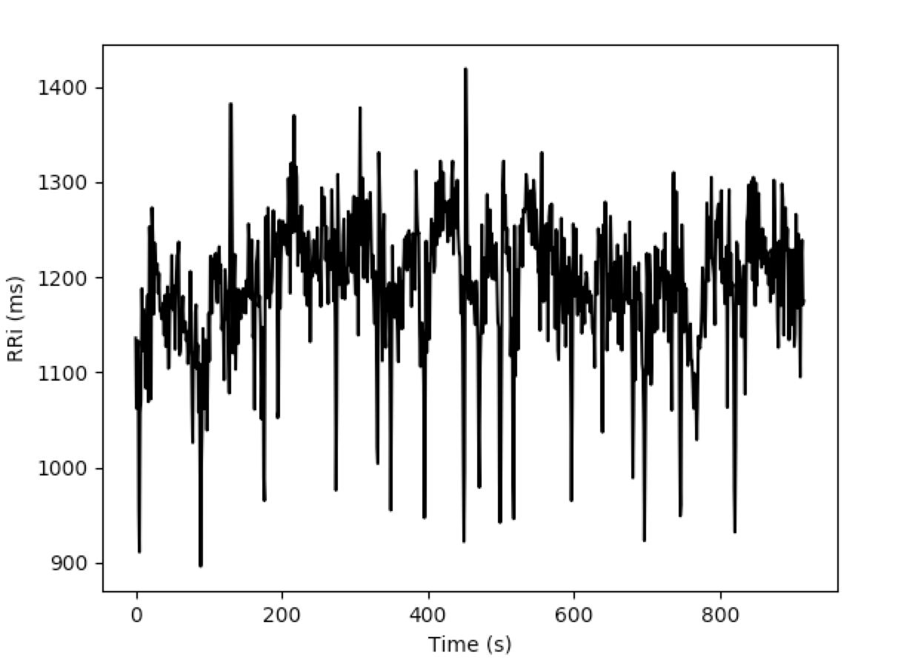
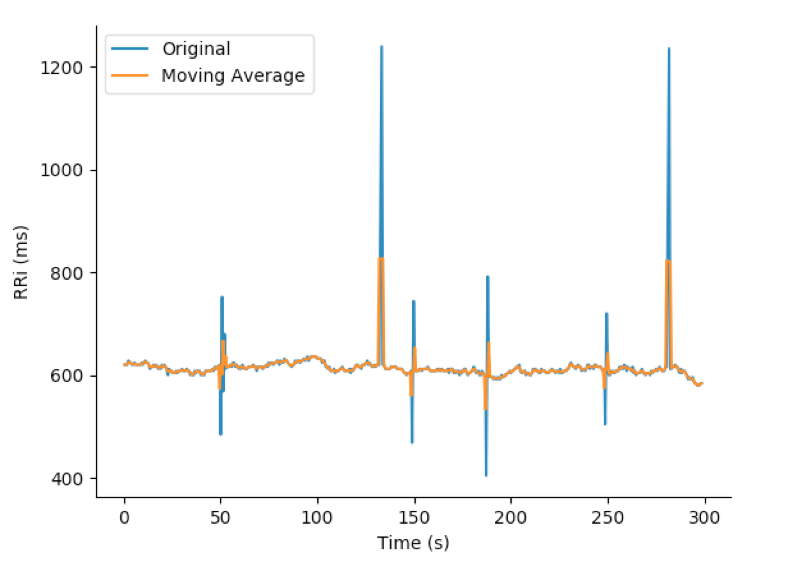
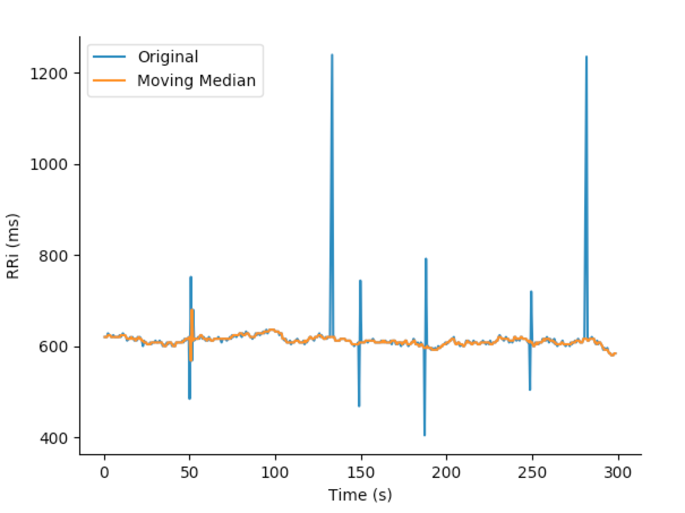
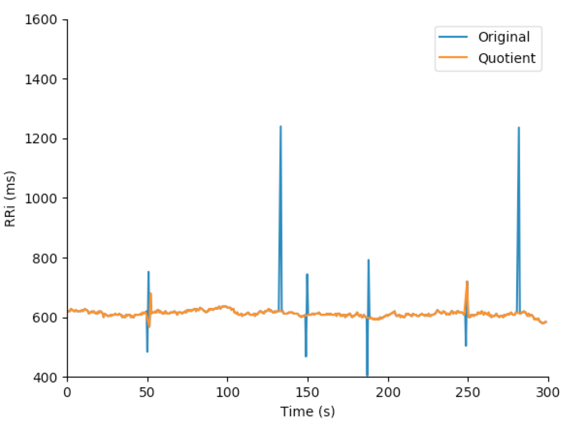

Heart Rate Variability Analysis Package
===============================

version number: 0.1.5
author: Rhenan Bartels

Overview
--------

A python package for heart rate variability analysis

Installation / Usage
--------------------

To install use pip:

    $ pip install hrv


Or clone the repo:

    $ git clone https://github.com/rhenanbartels/hrv.git
    $ python setup.py install
    
Contributing
------------

TBD

BASIC USAGE
-------

### Read RRi file

#### From .txt file.

Text files contains a single column with all RRi values.

```python
from hrv.utils import open_rri
rri = open_rri('path/to/file.txt')
rri
array([ 792.,  791.,  817., ...,  884.,  851.,  854.])
```

#### From .hrm file

The .hrm files contain the RRi acquired with Polar <sup>&reg;</sup>

A complete guide for .hrm files can be found [here](https://www.polar.com/files/Polar_HRM_file%20format.pdf).

```python
from hrv.utils import open_rri
rri = open_rri('path/to/file.hrm')
rri
array([ 1092.,  879.,  746., ...,  931.,  968.,  958.])
```



### Filters

Moving Average

```python
from hrv.filters import moving_average
filt_rri = moving_median(rri, order=3)
```



Moving Median

```python
from hrv.filters import moving_average
filt_rri = moving_median(rri, order=3)
```



Quotient

```python
from hrv.filters import moving_average
filt_rri = moving_median(rri, order=3)
```




## Time Domain Analysis
```python
from hrv.classical import time_domain
from hrv.utils import open_rri

rri = open_rri('path/to/file.txt')
results = time_domain(rri)
print(results)

{'mhr': 66.528130159638053,
 'mrri': 912.50302419354841,
 'nn50': 337,
 'pnn50': 33.971774193548384,
 'rmssd': 72.849900286450023,
 'sdnn': 96.990569261440797}
```

## Frequency Domain Analysis
```python
from hrv.classical import frequency_domain
from hrv.utils import open_rri

rri = open_rri('path/to/file.txt')
results = frequency_domain(
    rri=rri,
    fs=4.0,
    method='welch',
    interp_method='cubic',
    detrend='linear'
)
print(results)

{'hf': 1874.6342520920668,
 'hfnu': 27.692517001462079,
 'lf': 4894.8271587038234,
 'lf_hf': 2.6110838171452708,
 'lfnu': 72.307482998537921,
 'total_power': 7396.0879278950533,
 'vlf': 626.62651709916258}
```
## Non-linear Analysis
```python
from hrv.classical import non_linear
from hrv.utils import open_rri

rri = open_rri('path/to/file.txt')
results = non_linear(rri)
print(results)

{'sd1': 51.538501037146382,
 'sd2': 127.11460955437322}
```