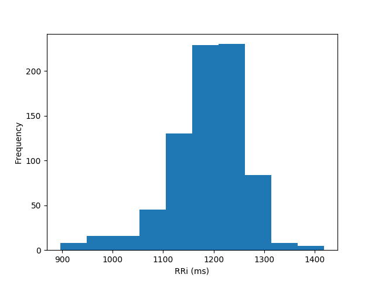
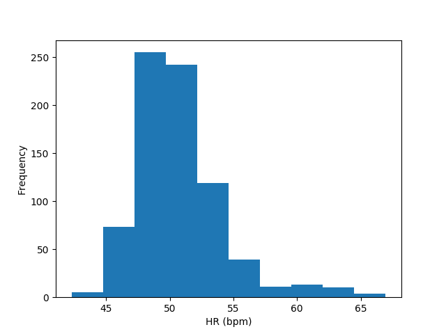
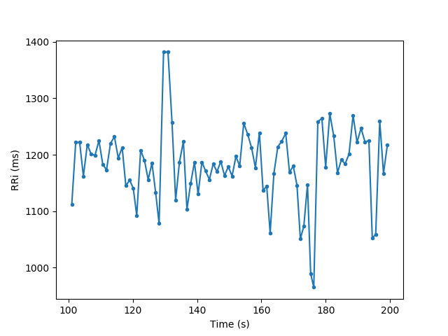
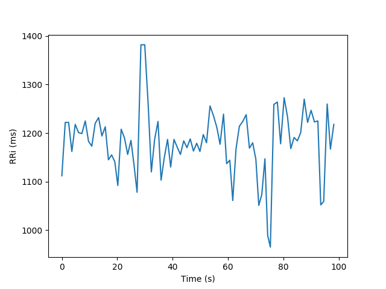
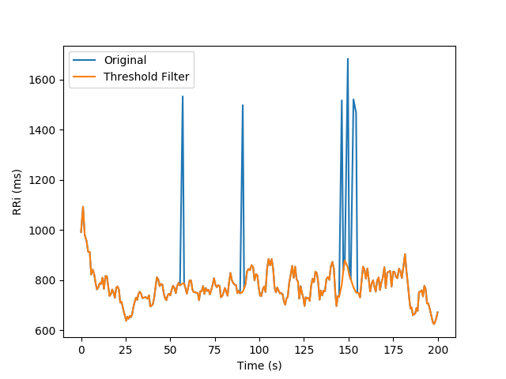
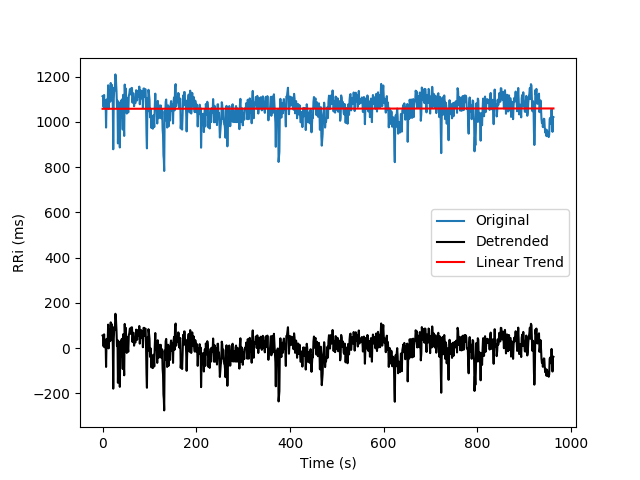
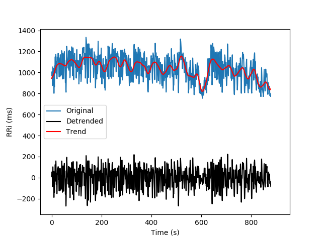
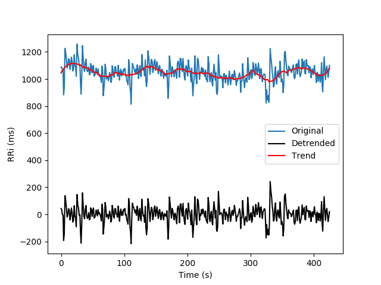
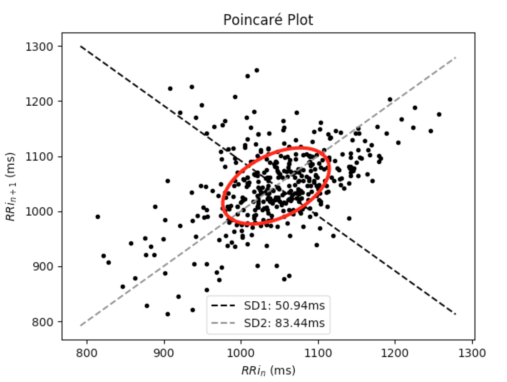

[](https://travis-ci.org/rhenanbartels/hrv)
[](https://codecov.io/gh/rhenanbartels/hrv)


Pythonic package for Heart Rate Variability Analysis
===============================

version number: 0.2.4 

author: Rhenan Bartels


Overview
--------

**hrv** is a simple Python module that brings the most widely used
techniques to work with RRi series and Heart Rate Variability (HRV) analyses without losing the **Power** and **Flexibility**
of a native Python object and [numpy](http://www.numpy.org/) arrays.

Installation / Usage
--------------------

To install use pip:

    $ pip install hrv


Or clone the repo:

    $ git clone https://github.com/rhenanbartels/hrv.git
    $ python setup.py install

BASIC USAGE
-------
## Create an RRi instance
Once you create an RRi object you will have the power of a native Python iterable object.
This means, that you can loop through it using a **for loop**, get a just a part of the series using native
**slicing** and much more. Let us try it:

```python
from hrv.rri import RRi

rri_list = [800, 810, 815, 750, 753, 905]
rri = RRi(rri_list)

print(rri)
RRi array([800., 810., 815., 750., 753., 905.])
```
#### Slicing
```python
print(rri[0])
800.0

print(type(rri[0]))
numpy.float64

print(rri[::2])
RRi array([800., 815., 753.])
```
#### Logical Indexing

```python
from hrv.rri import RRi

rri = RRi([800, 810, 815, 750, 753, 905])
rri_ge = rri[rri >= 800]

rri_ge
RRi array([800., 810., 815., 905.])

```

#### Loop

```python
for rri_value in rri:
    print(rri_value)

800.0
810.0
815.0
750.0
753.0
905.0
```
#### Note:
When time information is not provided, time array will be created using the cumulative sum of successive RRi. After cumulative sum, the time array is subtracted from the value at `t[0]` to make it start from `0s`

#### RRi object and time information
```python
from hrv.rri import RRi

rri_list = [800, 810, 815, 750, 753, 905]
rri = RRi(rri_list)

print(rri.time)
array([0.   , 0.81 , 1.625, 2.375, 3.128, 4.033]) # Cumsum of rri values minus t[0]

rri = RRi(rri_list, time=[0, 1, 2, 3, 4, 5])
print(rri.time)
[0. 1. 2. 3. 4. 5.]
```
#### Note:
Some validations are made in the time list/array provided to the RRi class, for instance: 

 - RRi and time list/array must have the same length;
 - Time list/array can not have negative values;
 - Time list/array must be monotonic increasing.

### Basic math operations
With RRi objects you can make math operatins just like a numpy array:

```python
rri
RRi array([800., 810., 815., 750., 753., 905.])

rri * 10
RRi array([8000., 8100., 8150., 7500., 7530., 9050.])

rri + 200
RRi array([1000., 1010., 1015.,  950.,  953., 1105.])
```

### Works with Numpy functions
```python
import numpy as np

rri = RRi([800, 810, 815, 750, 753, 905])

sum_rri = np.sum(rri)
print(sum_rri)
4833.0

mean_rri = np.mean(rri)
print(mean_rri)
805.5

std_rri = np.std(rri)
print(std_rri)
51.44171459039833
```

## Read RRi files

### From text (.txt) file

Text files contains a single column with all RRi values.
Example of RRi text file

```
800
810
815
750
```

```python
from hrv.io import read_from_text

rri = read_from_text('path/to/file.txt')

print(rri)
RRi array([800., 810., 815., 750.])
```

### From Polar <sup>&reg;</sup>  (.hrm) file

The .hrm files contain the RRi acquired with Polar <sup>&reg;</sup>

A complete guide for .hrm files can be found [here](https://www.polar.com/files/Polar_HRM_file%20format.pdf).

```python
from hrv.io import read_from_hrm

rri = read_from_hrm('path/to/file.hrm')

print(rri)
RRi array([800., 810., 815., 750.])
```

### From comma separated (.csv) file file
Example of csv file:

```
800,
810,
815,
750,
```

```python
from hrv.io import read_from_csv

rri = read_from_csv('path/to/file.csv')

print(rri)
RRi array([800., 810., 815., 750.])
```

#### Note:
When using **read\_from\_csv** you can also provide a column containing time information. Let's check it.

```
800,1
810,2
815,3
750,4
```

```python
rri = read_from_csv('path/to/file.csv', time_col_index=1)

print(rri)
RRi array([800., 810., 815., 750.])

print(rri.time)
array([0., 1., 2., 3., 4.])
```

### RRi statistics
The RRi object implements some basic statistics information about its values:

- mean
- median
- standard deviation
- variance
- minimum
- maximum
- amplitude

Some examples:

```python
from hrv.rri import RRi

rri = RRi([800, 810, 815, 750, 753, 905])

# mean
rri.mean()
805.5

# median
rri.median()
805.0
```
You can also have a complete overview of its statistical charactheristic

```python
desc = rri.describe()
desc
```

```
----------------------------------------
                   rri          hr
----------------------------------------
min             750.00       66.30
max             905.00       80.00
mean            805.50       74.78
var            2646.25       20.85
std              51.44        4.57
median          805.00       74.54
amplitude       155.00       13.70
```

```python
print(desc['std'])
{'rri': 51.44171459039833, 'hr': 4.5662272355549725}
```

## RRi Basic Information

```python
rri = RRi([800, 810, 815, 750, 753, 905])
rri.info()

N Points: 6
Duration: 4.03s
Interpolated: False
Detrended: False
Memory Usage: 0.05Kb
```

## RRi Visualization

The RRi class brings a very easy way to visualize your series:

### RRi Series

```python
from hrv.io import read_from_text

rri = read_from_text('path/to/file.txt')
fig, ax = rri.plot(color='k')

```


### RRi histogram and Heart Rate Histogram

```python
rri.hist()

rri.hist(hr=True)
```






## Time Slicing
It is also possible to slice RRi series with time range information
(in **seconds**).

In the following example, we are taking a slice that starts at `100s ` and ends at `200s`.

```python
from hrv.io import read_from_text

rri = read_from_text('path/to/file.txt')
rri_range = rri.time_range(start=100, end=200)

fig, ax = rri_range.plot(marker='.')
```


Time offset can be reset from the RRi series range:

```
rri_range.reset_time(inplace=True)
```


# Pre-Processing

## Filters

### Moving Average

```python
from hrv.filters import moving_average
filt_rri = moving_average(rri, order=3)

fig, ax = rri.plot()
filt_rri.plot(ax=ax)
```


### Moving Median

```python
from hrv.filters import moving_median
filt_rri = moving_median(rri, order=3)

fig, ax = rri.plot()
filt_rri.plot(ax=ax)
```


### Quotient
[Read more.](https://www.ncbi.nlm.nih.gov/pubmed/17322593)

```python
from hrv.filters import quotient
filt_rri = quotient(rri)

fig, ax = rri.plot()
filt_rri.plot(ax=ax)
```


### Threshold Filter

This filter is inspired by the threshold-based artifact correction algorithm offered by [Kubios](https://www.kubios.com/)<sup>&reg;</sup> .
To elect outliers in the tachogram series, each RRi is compared to the median value of local RRi (default N=5).
All the RRi which the difference is greater than the local median value plus a threshold is replaced by
[cubic spline](https://en.wikiversity.org/wiki/Cubic_Spline_Interpolation) interpolated RRi.

The threshold filter has five pre-defined strength values:

    - Very Low: 450ms
    - Low: 350ms
    - Medium: 250ms
    - Strong: 150ms
    - Very Strong: 50ms
It also accepts custom threshold values (in milliseconds).
The following snippet shows the ectopic RRi removal:

```python
from hrv.filters import threshold_filter
filt_rri = threshold_filter(rri, threshold='medium', local_median_size=5)

fig, ax = rri.plot()
filt_rri.plot(ax=ax)
```



## Detrending
The ```hrv``` module also offers functions to remove the non-stationary trends from the RRi series.
It allows the removal of slow linear or more complex trends using the following approaches:

### Polynomial models

Given a degree a polynomial filter is applied to the RRi series and subtracted from the tachogram

```python
from hrv.detrend import polynomial_detrend

rri_detrended = polynomial_detrend(rri, degree=1)

fig, ax = rri.plot()
rri_detrended.plot(ax, color='k')
```



### Smoothness priors

Developed by Tarvainen *et al*, allow the removal of complex trends. Visit [here](https://ieeexplore.ieee.org/document/979357) for more information.
It worth noticing that the detrended RRi with the Smoothness priors approach is also interpolated
and resampled using frequency equals to ```fs```.

```python
from hrv.detrend import smoothness_priors

rri_detrended = smoothness_priors(rri, l=500, fs=4.0)

fig, ax = rri.plot()
rri_detrended.plot(ax, color='k')
```



#### Note:
this approach depends on a numpy matrix inversion and due to floating-point precision it might
present round-off errors in the trend calculation

### Savitzky-Golay

Uses the lowpass filter known as  Savitzky-Golay filter to smooth the RRi series and remove slow components from the tachogram

```python
from hrv.detrend import sg_detrend

rri_detrended = sg_detrend(rri, window_size=51, polyorder=3)

fig, ax = rri.plot()
rri_detrended.plot(ax, color='k')
```


# Analysis

## Time Domain Analysis
```python
from hrv.classical import time_domain
from hrv.io import read_from_text

rri = read_from_text('path/to/file.txt')
results = time_domain(rri)
print(results)

{'mhr': 66.528130159638053,
 'mrri': 912.50302419354841,
 'nn50': 337,
 'pnn50': 33.971774193548384,
 'rmssd': 72.849900286450023,
 'sdnn': 96.990569261440797,
 'sdsd': 46.233829821038042}
```

## Frequency Domain Analysis
```python
from hrv.classical import frequency_domain
from hrv.io import read_from_text

rri = read_from_text('path/to/file.txt')
results = frequency_domain(
    rri=rri,
    fs=4.0,
    method='welch',
    interp_method='cubic',
    detrend='linear'
)
print(results)

{'hf': 1874.6342520920668,
 'hfnu': 27.692517001462079,
 'lf': 4894.8271587038234,
 'lf_hf': 2.6110838171452708,
 'lfnu': 72.307482998537921,
 'total_power': 7396.0879278950533,
 'vlf': 626.62651709916258}
```
## Non-linear Analysis
```python
from hrv.classical import non_linear
from hrv.io import read_from_text

rri = read_from_text('path/to/file.txt')
results = non_linear(rri)
print(results)

{'sd1': 51.538501037146382,
 'sd2': 127.11460955437322}
```

It is also possible to depict the Poincaré Plot, from which SD1 and SD2 are derived:

```python
rri.poincare_plot()
```


Contribution start guide
------------------------

The preferred way to start contributing for the project is creating a virtualenv (you can do by using virtualenv,
virtualenvwrapper, pyenv or whatever tool you'd like).

Create the virtualenv:

```bash
mkvirtualenv hrv
```

Install all dependencies:

```bash
pip install -r requirements.txt
```

Install development dependencies:

```bash
pip install -r dev-requirements.txt
```

## Running the tests

In order to run the tests, activate the virtualenv and execute pytest:

```bash
workon <virtualenv>
pytest -v
```
