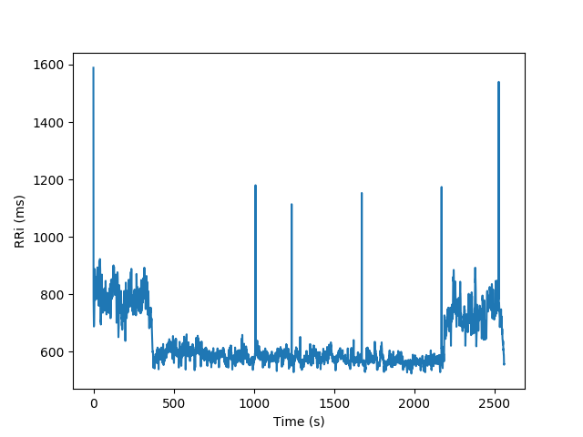
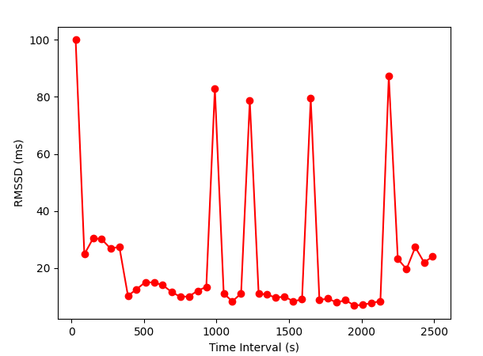
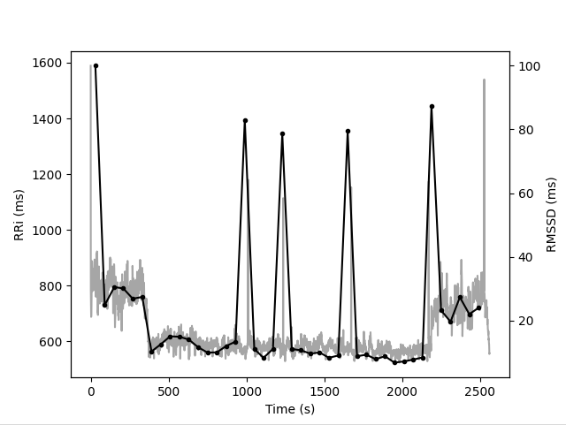

Non-stationary RRi series
============

In some situations like physical exercise, the RRi series might present
a non-stationary behavior. In cases like these, classical approaches are not
recommended once the statistical properties of the signal vary over time.

The following figure depicts the RRi series recorded on a subject riding a bicycle.
Without running analysis and only visually inspecting the time series, is possible
to tell that the average and the standard deviation of the RRi are not constant
as a function of time.

In order to extract useful information about the dynamics of non-stationary RRi series,
the following methods applies the classical metrics in shorter running adjacent segments.

Time Varying
############

Time domain indices applied to shorter segments

.. code-block:: python

    from hrv.sampledata import load_exercise_rri
    from hrv.nonstationary import time_varying

    rri = load_exercise_rri()
    results = time_varying(rri, seg_size=30, overlap=0)
    results.plot(index="rmssd", marker="o", color="r")

Plot the results from **time varying** together with its respective RRi series

.. code-block:: python

    from hrv.sampledata import load_exercise_rri
    from hrv.nonstationary import time_varying

    rri = load_exercise_rri()
    results = time_varying(rri, seg_size=30, overlap=0)
    results.plot_together(index="rmssd", marker="o", color="k")

Short Time Fourier Transform
############################

To be implemented.

.. image:: ../figures/rri_range.png
    :width: 500 px

Time offset can be reset from the RRi series range:

.. code-block:: python

    rri_range.reset_time(inplace=True)

.. image:: ../figures/rri_range_reset.png
    :width: 500 px
